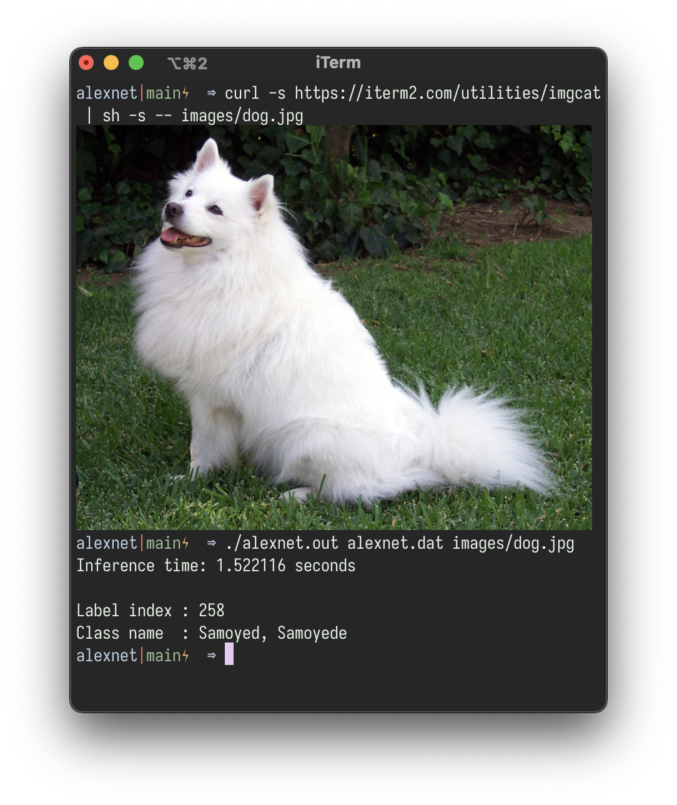

# Neural network runtime library

Load neural net weight trained in python (as NumPy array) in C, use it for inference.
The runtime library is written in pure C.
This library is **not designed for training** neural net models.

## Running examples

The python examples use PyTorch, so you need to install it (and NumPy). Run the python script to train and dump model weights, then build and run the C programs.

- Iris:

        $ python iris.py
        $ make iris && ./iris.out

- CNN:

        $ python cnn.py
        $ make cnn && ./cnn.out

## Some neural nets

### AlexNet

Run `make alexnet` at the project root directory
